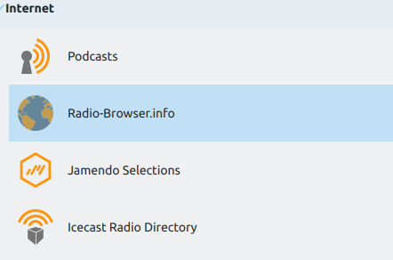
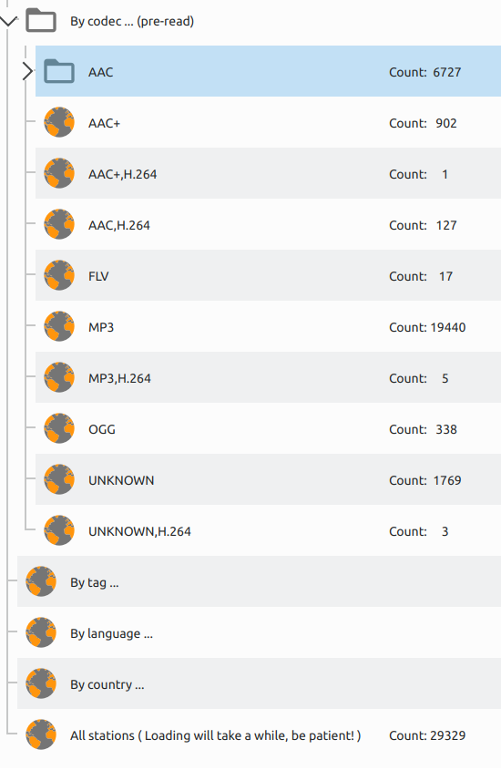
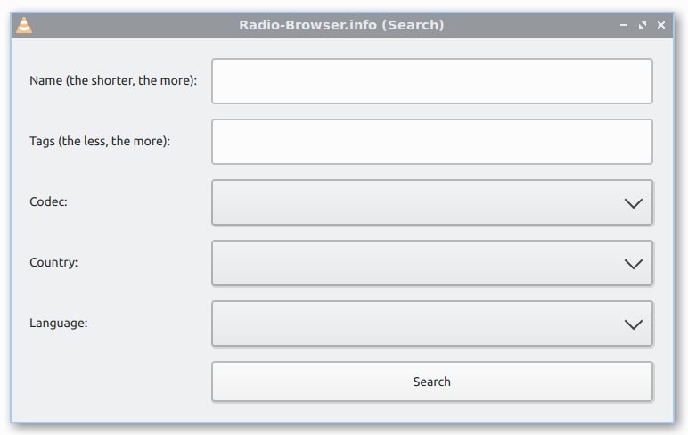

 Radio-Browser.info Lua Plugins for VLC

 Copyright © 2020 Andrew Jackson (https://github.com/ceever ... ceever@web.de)

 This program is free software; you can redistribute it and/or modify
 it under the terms of the **GNU General Public License** as published by
 the Free Software Foundation; either version 2 of the License, or
 (at your option) any later version.

 This program is distributed in the hope that it will be useful,
 but WITHOUT ANY WARRANTY; without even the implied warranty of
 MERCHANTABILITY or FITNESS FOR A PARTICULAR PURPOSE.  See the
 GNU General Public License for more details.

 You should have received a copy of the GNU General Public License
 along with this program; if not, write to the Free Software
 Foundation, Inc., 51 Franklin Street, Fifth Floor, Boston MA 02110-1301, USA.
 
 **The service discovery and category lists:** 

**The search windows:**

**BUGS & REQUESTS:**

Send me an email or open a ticket on github.

**INSTALLATION:**

Put the according .lua file in the according subfolder of the VLC lua directory. VLC lua directory by default:
* Windows (all users): %ProgramFiles%\VideoLAN\VLC\lua\
* Windows (current user): %APPDATA%\VLC\lua\
* Linux (all users): /usr/lib/vlc/lua/
* Linux (current user): ~/.local/share/vlc/lua/
(create directories if they don't exist)

According .lua file and according subfolder:
* ex_Radio-Browser_info.lua => ...\lua\extensions\
* sd_Radio-Browser_info.lua => ...\lua\sd\
* pl_Radio-Browser_info.lua => ...\lua\playlist\

Restart VLC.

**EXPLANATION & USAGE:**

pl_Radio-Browser_info.lua:
* This plugin is needed by sd_Radio-Browser_info.lua (!)
* It converts Radio-Browser.info api specific links into lists or readable radio links
* Generally you would not add such links manually

sd_Radio-Browser_info.lua:
* Radio-Browser.info Service Discovery plugin for VLC ... i.e. listed on the left panel under "Internet"
* Explore and crawls through all radio stations classified by categories
* Depends on the previous pl_Radio-Browser_info.lua for it to work
* After having found one or more list(s) of specific stations it is best to copy them into the playlist and continue searching and sorting there, since the Service Discovery zone is a little limited in its capabilities, especially after having found several list of sub categories.

ex_Radio-Browser_info.lua:
* Works standalone without the other two plugins
* A simple search to retrieve the search specific radio stations
* Search results are added to the existing (empty or non-empty) playlist
* The more specific a search the less results, even 0
* The dropdown lists will not update if one of the others dropdown is selected. This means you can have a situation where two or more selections of dropdown list produce 0 results, even though they specify existing stations in brackets, e.g. "Codec: AAC+ (102)" and "Language: Albania (27)".
