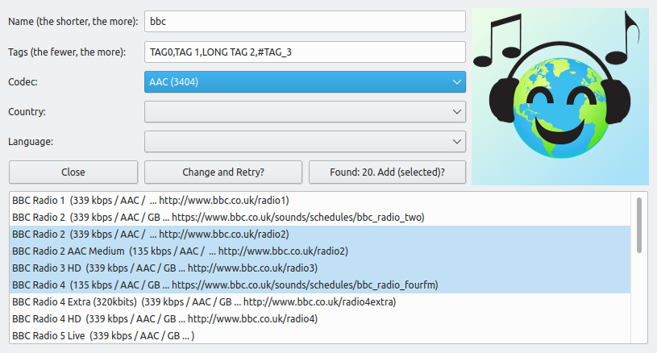

## Radio-Browser.info Addons for VLC

**VLC Service Discovery / Internet and Search Window add-ons (aka lua scripts) for the Radio-Browser.info database**

* Website / DB: https://www.radio-browser.info/
* Various alternative apps and add-ons: https://www.radio-browser.info/users

---
 Copyright © 2020-2023 Andrew Jackson (https://github.com/ceever)

 This program is free software; you can redistribute it and/or modify
 it under the terms of the **GNU General Public License** as published by
 the Free Software Foundation; either version 2 of the License, or
 (at your option) any later version.

 This program is distributed in the hope that it will be useful,
 but WITHOUT ANY WARRANTY; without even the implied warranty of
 MERCHANTABILITY or FITNESS FOR A PARTICULAR PURPOSE.  See the
 GNU General Public License for more details.

 You should have received a copy of the GNU General Public License
 along with this program; if not, write to the Free Software
 Foundation, Inc., 51 Franklin Street, Fifth Floor, Boston MA 02110-1301, USA.

---
**The Radio-Browser search window in VLC:**

 
**The Service Discovery / Internet (tab) in VLC:** 

 

---
**BUGS & REQUESTS:**

Send me a mail or a ticket on github.

---
**UPDATES:**

05.03.2023: v0.7 (ex)
1. Added a search results list, to select specific stations and only add them to the VLC playlist.
2. The search window remains open now after having added stations, so one can continue with another (different) search.
3. The search window will close automatically when playback is started in the VLC playlist.

18.02.2023: v0.62 (ex)
1. Better handling of names and tags, auto removing unnecessary whitespaces.
2. Updated tag search, now only commas count as separators. Space, #, etc. are now allowed in tags. And thus, included an indication of tag search pattern with each new search window: TAG0,TAG 1,LONG TAG 2,#TAG_3
3. Updated button order for three buttons—more intuitive now.
4. Better API server handling, getting list from the API itself instead of guessing.
5. Switched from https to http for performance and certificate compatibility reasons (change lua script if you still want https).

03.02.2023: v0.61 (ex)
1. Fixed a Windows 10 / VLC incompatibility
2. Changed button order so hitting ENTER starts the search and not closed the window

28.12.2022: v0.59 (sd & pl): Fixed some bugs due to changes to the radio-browser.info API.

---
**INSTALLATION:**

Put the relevant .lua file(s) into the according subfolder (see below) of the VLC lua directory. VLC lua directory by default:
* Windows (all users): %ProgramFiles%\VideoLAN\VLC\lua\
* Windows (current user): %APPDATA%\VLC\lua\
* Linux (all users): /usr/share/vlc/lua/
* Linux (current user): ~/.local/share/vlc/lua/
(create directories if they don't exist)

.lua files and according subfolder:
* ex_Radio_Browser_info.lua => ...\lua\extensions\
* sd_Radio_Browser_info.lua => ...\lua\sd\
* pl_Radio_Browser_info.lua => ...\lua\playlist\

(In case you want the nice smiley with the search extension as in the screenshots, place the "Radio-Browser.png" picture from the Github "gfx/" folder or the zip repository into "...\lua\extensions\" and change the path of the picture 'd:add_image("PATH")' in the "ex_Radio_Browser_info.lua" script.
Note, under MS Windows you may need to use double backslashes, e.g. 'd:add_image("C:\\\\Program Files\\\\VideoLAN\\\\VLC\\\\lua\\\\extensions\\\\Radio-Browser.png")')

Restart VLC.

---
**EXPLANATION & USAGE:**

**Important**: With these add-ons the VLC columns *Album*, *Genre* and *Description* will hold relevant information for each radio station, namely: 1) Album: either *Count: XXXX* or *Clicks: XXXX* (to sort on number of stations or popularity), 2) Genre: a genre desciption, and 3) Description: sortable Bitrate information. So, have them displayed and try to use them if feasible.

Inside the Service Discover / Internet tab of VLC you are better off transferring all (relevant) stations into the regular VLC playlist first (right click >> "Add to Playlist"), before trying to sort anything.

pl_Radio-Browser_info.lua (playlist plugin for Service Discovery):
* This plugin is needed by sd_Radio-Browser_info.lua (!).
* It converts Radio-Browser.info API specific links into lists or readable radio links.
* Generally you would not add such links manually.

sd_Radio-Browser_info.lua (Service Discovery / Internet):
* Service Discovery / Internet add-on for VLC ... i.e. listed on the left panel under "Internet".
* Explore and crawls through all radio stations classified by categories (codec, language, country, tag).
* It depends on pl_Radio-Browser_info.lua—both need to be installed at the same time.
* After having found one or more stations in the Service Discovery / Internet, it is best to copy them into the playlist (right click >> "Add to Playlist") and continue searching and them sorting there. The Service Discovery is a little limited in its sorting capabilities, especially after having explored several sub categories.

ex_Radio-Browser_info.lua (Search window):
* Found under the VLC menu: View >> "Radio-Browser.info (Search)"
* This can work standalone, without the other two add-ons/lua scripts.
* Searches are sent unencrypted via http, due to performance and cerificate error reasons. Change the http to https in the lua script if you want.
* Found radio stations are counted, and can be added to the regular (empty or non-empty) VLC playlist.
* Dropdown lists will not update (counts nor values) if one of the others search parameters is specified. Thus, even when specific stations exist, e.g. "Codec: AAC+ (102)" and "Language: Albania (27)", together they might not produce any results.
* In general, the more specific the search the less radio stations—some search parameters might exclude each other, e.g. language=afrikaans and country=Russia.
